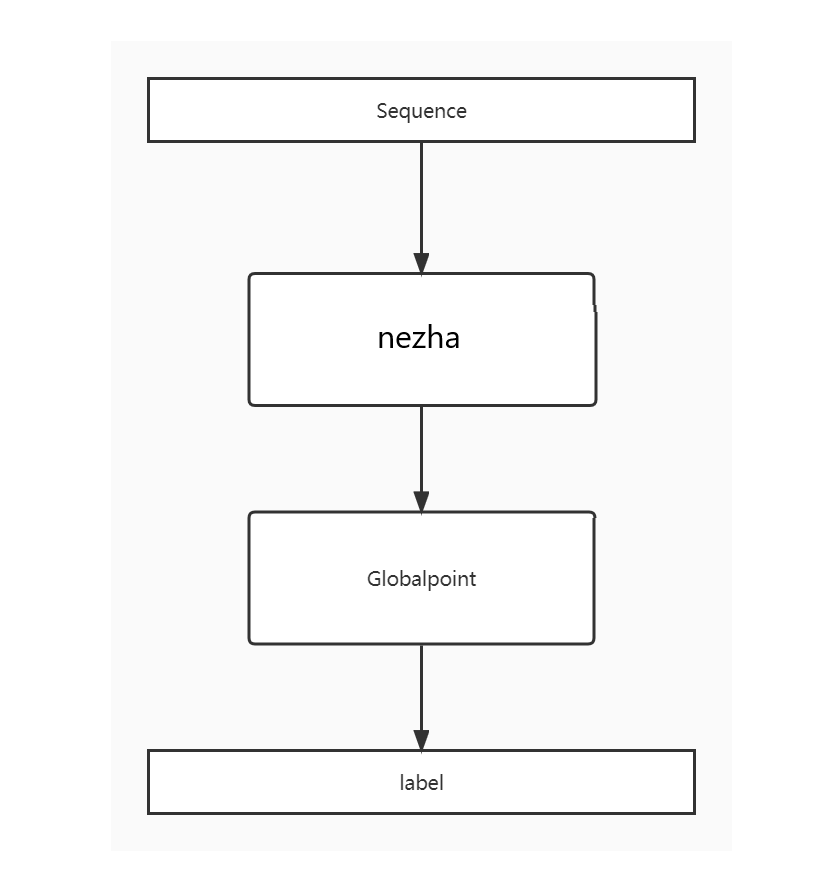

# [比赛链接](https://www.heywhale.com/org/gaiic2022/competition/area/620b34ed28270b0017b823ad/content)
# 代码说明
persuda.pt: 制作伪标签  
pretrain_uer-large.py：对nezha进行进一步预训练代码  

## 环境配置

训练所使用平台为$python==3.7$，$pytorch==1.11.0$，$cudatoolkit==11.3$，3090显卡。
初始化环境：

```
sh init.sh
```

其中pytorch安装后，可能会出现与显卡驱动不匹配的问题需要手动解决，输入：

```
conda install pytorch torchvision torchaudio cudatoolkit=11.3 -c pytorch
```

## 数据

使用了大赛提供的4w训练集和100w无标签数据

## 预训练模型

使用了nezha-base预训练模型.可以通过https://github.com/lonePatient/NeZha_Chinese_PyTorch 获得.

## 算法

模型上游使用nezha生成高质量的word embedding，再将word embedding输入到global pointer中生成标签。

### 整体思路介绍

1. 利用100w无标签数据对nezha-base进行mlm任务预训练
2. 利用4w标签数据训练3-4个模型，对test集进行预测，生成伪标签
3. 将1w伪标签和4w标签数据混和在一起，在第一步得到的预训练结果上进行微调

### 网络结构



### 损失函数

  $\log \left(1+\sum_{i \in \Omega_{n e g}} e^{s_{i}}\right)+\log \left(1+\sum_{j \in \Omega_{p o s}} e^{-s_{j}}\right)$  

$s_i$为属于当前类别实体的得分，$s_j$为不属于当前类别实体的得分。

### 数据增广

利用4w标签数据训练3-4个模型，从100w无标签数据中随机抽取1w数据生成伪标签，加入到训练集中

## 训练流程

这里只给出了在10轮mlm预训练后得到的nezha-mlm上进行微调训练的过程，使用的训练数据为4w的标注数据和1w的伪标签。  
启动训练：
```
conda activate pyt
sh train.sh
```

## 其他注意事项

前期训练阶段将官方给出的4w标注训练集划分为train和dev集，划分比例为9：1，选取的划分随机种子为42。